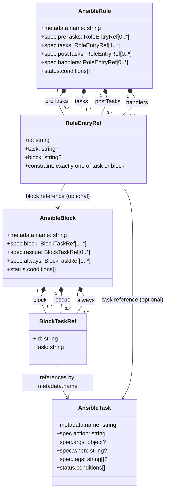

# CRD Domain Model

This diagram represents the current CRD model and semantic relationships used by `krun`.

## Notes

- All resources are namespaced.
- `RoleEntryRef` uses a union constraint: exactly one of `task` or `block`.
- `AnsibleRole` may reference `AnsibleBlock`; `AnsibleBlock` references `AnsibleTask`.
